 

 

&nbsp;

&nbsp;

&nbsp;

&nbsp;

 

---

 

 

Security professional and builder. Days spent hardening cloud infrastructure at **Snowflake** — nights shipping AI-native tools that make security engineering faster and smarter. Previously at Ernst & Young.

**Certified** &nbsp; `Azure` &nbsp; `AWS` &nbsp; `OneTrust Privacy Fellow` &nbsp;&nbsp; **MBA** — Symbiosis International University

 

---

 

 

**[AI-Security-Copilot](https://github.com/vidit135g/AI-Security-Copilot)**
&nbsp;—&nbsp; 9 LangGraph agents covering vulnerability triage, PR review, cloud posture, and incident response. Streaming copilot powered by Claude Sonnet.
`Python` `LangGraph` `FastAPI` `Next.js` `Claude`

 

**[soc2-reviewer](https://github.com/vidit135g/soc2-reviewer)**
&nbsp;—&nbsp; Upload any SOC 2 PDF, get deterministic validation + RAG-grounded chat + executive dashboard in under a minute. Runs fully local with Ollama.
`Next.js 15` `FastAPI` `pgvector` `Docker` `PostgreSQL`

 

**[seceng-portal](https://github.com/vidit135g/seceng-portal)**
&nbsp;—&nbsp; Security Engineering with AI Agents — a structured learning portal for practitioners.
`HTML` `Security Engineering`

 

**[resume-intel](https://github.com/vidit135g/resume-intel)**
&nbsp;—&nbsp; AI-powered resume intelligence and structured insight extraction.
`JavaScript` `AI / NLP`

 

Data science

 

**[Neighborhood Analysis](https://github.com/vidit135g/Neighborhood_Analysis)** — Geospatial clustering via Foursquare, Folium, and scikit-learn.

**[UHI Predictor](https://github.com/vidit135g/UHI-Predictor)** — Urban Heat Island prediction for climate and urban planning.

 

---

 

 

 

---

 

  

&nbsp;

  

  

 

---

 

 

| App | Stars |
|:----|------:|
| [Floral](https://github.com/vidit135g/Floral) — minimal material gallery | ⭐ 50 |
| [Replify-Messenger](https://github.com/vidit135g/Replify-Messenger) — minimal SMS messenger | ⭐ 25 |
| [Sticker_Maker](https://github.com/vidit135g/Sticker_Maker) — WhatsApp sticker creator | ⭐ 23 |
| [Notes-Central](https://github.com/vidit135g/Notes-Central) — clean material notes | ⭐ 8 |
| [Weathercast](https://github.com/vidit135g/Weathercast) — minimal weather app | ⭐ 4 |

 

---

 

